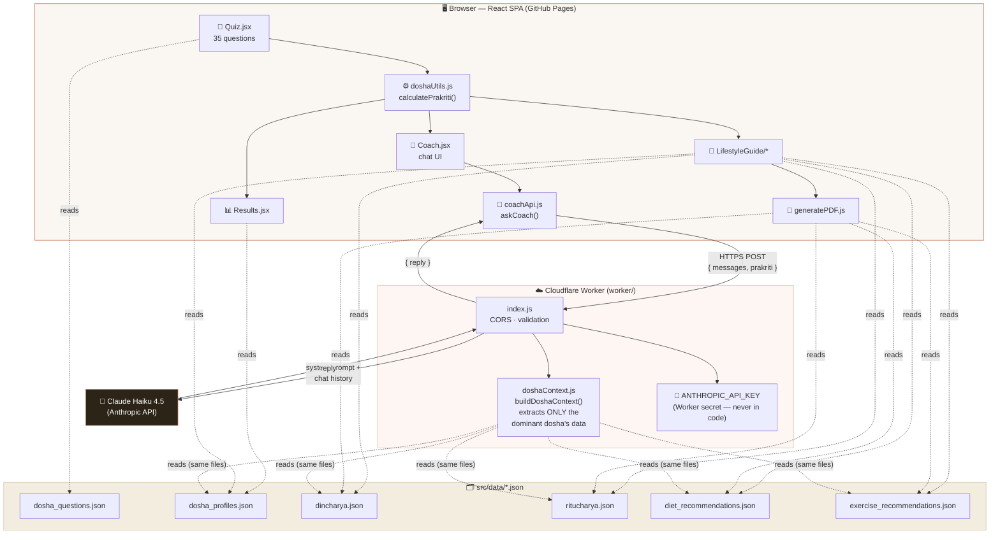

<div align="center">

# 🌿 AI-Powered Ayurveda Prakriti Assistant

### *Know your Dosha. Live your Prakriti. Ask anything.*

A React app that scores a 35-question Ayurveda quiz into your Vata / Pitta / Kapha constitution, then hands you off to a **Claude-powered AI Coach** for personalised, conversational guidance — diet, daily routine, seasonal living, and exercise, all grounded in your own result.

[](https://rajasree-gorrepati.github.io/prakriti_project/)

</div>

---

## ✨ Features

| | Feature | Description |
|---|---|---|
| 🧘 | **35-Question Assessment** | Physical, physiological, mental, behavioral & emotional questions, each scored to Vata / Pitta / Kapha |
| 📊 | **Dosha Results** | Donut chart breakdown — supports single, dual-dosha, and tridoshic (balanced) constitutions |
| 📅 | **Personalised Lifestyle Guide** | 4 tabs: Dincharya (daily routine), Ritucharya (6 seasons), Ahara (diet), Vyayama (exercise + yoga) |
| 📄 | **PDF Export** | Download your full lifestyle guide as a clean, formatted PDF |
| 🤖 | **AI Coach Chat** | Ask free-form questions — answered by Claude, personalised to *your* dominant dosha, never generic |
| 📝 | **Markdown + Tables** | AI replies render headings, bold, lists, and tables (great for weekly meal plans!) |
| ⚠️ | **Responsible by Design** | Herb/practitioner disclaimer surfaced throughout — moderation & body awareness first |
| 🔐 | **Secure by Architecture** | The Claude API key never touches the browser — it lives only in a Cloudflare Worker secret |

---

## 🛠️ Tech Stack

<div align="center">


</div>

| Layer | Choice | Why |
|---|---|---|
| Frontend | React 19 + Vite 8 | Fast dev loop, no router needed — a single state machine drives navigation |
| Styling | Tailwind CSS v4 (`@tailwindcss/vite`) | No config file, no `@tailwind` directives — just `@import "tailwindcss"` |
| Charts | Recharts | Donut chart for dosha percentage breakdown |
| PDF | jsPDF | Hand-built text layout — no DOM screenshot, small reliable output |
| AI backend | Cloudflare Worker + `@anthropic-ai/sdk` | The *only* backend in the app — keeps the Claude API key server-side |
| AI model | `claude-haiku-4-5` | Fast & cost-bounded — the Worker endpoint is public, so cost/abuse exposure matters |
| Markdown | `react-markdown` + `remark-gfm` | Renders headings, bold, lists, and **GFM tables** in AI replies |
| Hosting | GitHub Pages (`gh-pages`) | Frontend only — fully static |

---

## 🏗️ Architecture



**Key idea:** the frontend never talks to Anthropic directly. `coachApi.js` only ever calls the Worker, and the Worker is the only place the Claude API key exists.

---

## 📁 Folder Structure

```
prakriti_project/
├── public/                      # Static assets served as-is
│   ├── favicon.svg
│   └── icons.svg
├── src/
│   ├── assets/                  # Images used in the UI
│   ├── components/
│   │   ├── Intro.jsx            # Landing / welcome screen
│   │   ├── Quiz.jsx             # 35-question assessment flow
│   │   ├── Results.jsx          # Dosha donut chart + traits
│   │   ├── Coach.jsx            # 🤖 AI Coach chat UI
│   │   └── LifestyleGuide/
│   │       ├── LifestyleGuide.jsx
│   │       ├── DincharyaTab.jsx # Daily routine
│   │       ├── RitucharyaTab.jsx# Seasonal routine
│   │       ├── DietTab.jsx      # Diet (Ahara)
│   │       └── ExerciseTab.jsx  # Exercise & yoga (Vyayama)
│   ├── data/                    # 📚 Ayurveda knowledge base (JSON)
│   │   ├── dosha_questions.json
│   │   ├── dosha_profiles.json
│   │   ├── dincharya.json
│   │   ├── ritucharya.json
│   │   ├── diet_recommendations.json
│   │   └── exercise_recommendations.json
│   ├── utils/
│   │   ├── doshaUtils.js        # calculatePrakriti() + dosha colors
│   │   ├── generatePDF.js       # jsPDF lifestyle guide export
│   │   └── coachApi.js          # Frontend → Worker fetch wrapper
│   ├── App.jsx                  # Page state machine
│   └── main.jsx
├── worker/                       # ☁️ Cloudflare Worker (AI Coach backend)
│   ├── src/
│   │   ├── index.js              # Request handling, CORS, Claude call
│   │   └── doshaContext.js       # Per-dosha system-prompt builder
│   └── wrangler.toml
├── CLAUDE.md                     # Guidance for AI coding agents
└── vite.config.js
```

---

## 🚀 Installation

This repo is **two independent projects**: the frontend (root) and the AI Coach backend (`worker/`).

### 1. Clone & install the frontend

```bash
git clone https://github.com/RAJASREE-GORREPATI/prakriti_project.git
cd prakriti_project
npm install
npm run dev          # → http://localhost:5173
```

### 2. Set up the AI Coach Worker (optional, for local AI Coach testing)

```bash
cd worker
npm install

# Create worker/.dev.vars (gitignored — never commit this file)
echo "ANTHROPIC_API_KEY=sk-ant-..." > .dev.vars

npm run dev           # → http://127.0.0.1:8787
```

> The deployed app already points at a live Worker, so step 2 is only needed if you want to run/modify the AI Coach backend yourself.

### Available scripts (frontend)

| Command | Description |
|---|---|
| `npm run dev` | Start the Vite dev server |
| `npm run build` | Production build to `dist/` |
| `npm run preview` | Preview the production build locally |
| `npm run lint` | Run ESLint |
| `npm run deploy` | Build + publish `dist/` to GitHub Pages |

---

## ☁️ Deployment

**Frontend → GitHub Pages**
```bash
npm run deploy
```
This runs `vite build` then publishes `dist/` via [`gh-pages`](https://www.npmjs.com/package/gh-pages). The Vite `base` (`vite.config.js`) and `homepage` (`package.json`) must match the GitHub repo name/owner exactly, or asset paths break.

**AI Coach → Cloudflare Workers**
```bash
cd worker
wrangler secret put ANTHROPIC_API_KEY   # one-time, or on key rotation
npm run deploy
```
CORS is locked down in `worker/src/index.js` (`ALLOWED_ORIGINS`) to the deployed GitHub Pages origin + `localhost:5173` — update this list if the site is ever moved to a new domain or repo.

---

## 🌐 Live Demo

### 👉 **[rajasree-gorrepati.github.io/prakriti_project](https://rajasree-gorrepati.github.io/prakriti_project/)**

---


<div align="center">

Built with 🌿 Ayurvedic wisdom + 🤖 Claude · *Moderation and body awareness, always.*

</div>
